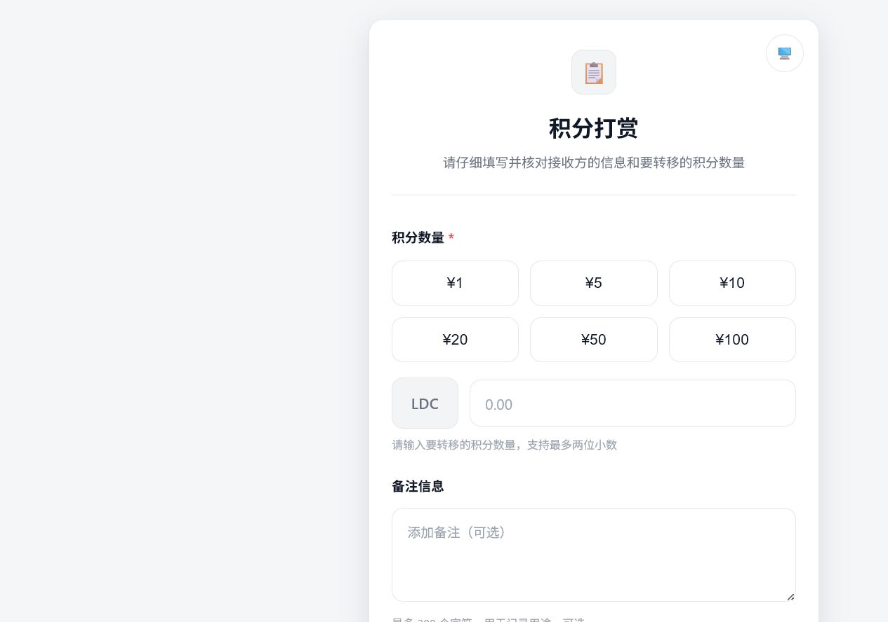
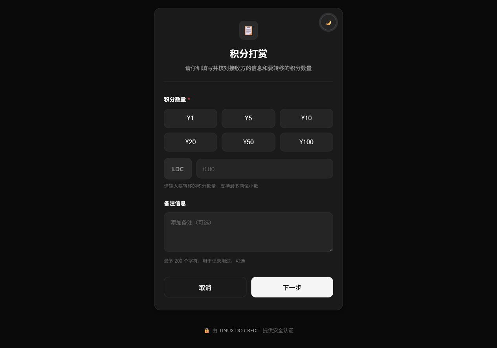

# LINUX DO CREDIT 积分流转助手

[English README](README_EN.md)

当前版本：**v2.0.1**

一个面向 [Linux.do](https://linux.do) 论坛社区的轻量积分流转小工具。它把 LINUX DO CREDIT 提供的易支付兼容接口包装成简洁的网页插件，让论坛用户可以更方便地选择积分数量、填写备注并完成积分流转。

## 项目定位与非商业声明

本项目仅服务于 Linux.do 论坛社区内的积分使用场景，是对 LINUX DO CREDIT 接口的开源客户端封装，不是面向公众经营的商业支付平台。

- 仅处理 LINUX DO CREDIT 体系内的论坛积分流转，不处理人民币或其他法定货币。
- 不提供充值、提现、资金托管、清算、兑换或其他金融服务。
- 项目本身不发行积分，也不改变积分规则；积分账户、认证和实际流转均由 LINUX DO CREDIT 完成。
- 维护者不收取平台费、服务费或交易抽成，不以本项目开展付费经营。
- 项目以开源、非商业方式提供，主要用途是降低论坛用户使用积分流转功能的操作门槛。

页面中出现的“支付”“订单”等词汇来自上游易支付兼容接口的字段命名，在本项目语境中均指论坛积分流转，不代表法币支付或商业收款业务。

## 界面预览

浅色主题：



深色主题：



## ✨ 功能特性

- 🔢 自定义积分数量 + 预设数量快捷按钮
- 💬 支持积分流转备注
- 🎨 适配 Linux.do Credit 使用场景的暗色主题
- 📱 完美支持移动端
- 🔒 对接 LINUX DO CREDIT 的签名验证与异步通知

---

## 🚀 选择部署方式

| 方式 | 难度 | 适用场景 | 需要服务器 |
|-----|------|---------|-----------|
| **[Vercel 部署](VERCEL.md)** | ⭐ 简单 | 无服务器托管、快速上线 | ❌ 不需要 |
| **[Docker 部署](#-docker-部署)** | ⭐⭐ 简单 | 自托管、完整功能 | ✅ 需要 |
| **[PHP 部署](#-php-手动部署)** | ⭐⭐⭐ 中等 | 传统服务器 | ✅ 需要 |

---


## 🐳 Docker 部署

适合有服务器的用户，支持完整功能（订单持久化存储）。

### 步骤 1：获取 API 密钥

同上，在 [credit.linux.do](https://credit.linux.do) 创建应用并记录密钥。

### 步骤 2：配置文件

```bash
# 克隆项目
git clone https://github.com/Razewang/LINUX_EASY_CREDIT.git
cd LINUX_EASY_CREDIT

# 创建配置文件
cp config/config.example.php config/config.php
nano config/config.php
```

填写配置：

```php
'epay' => [
    'pid' => '你的 Client ID',
    'key' => '你的 Client Secret',
    'notify_url' => 'https://你的域名/api/notify.php',
    'return_url' => 'https://你的域名/success.html',
],
```

### 步骤 3：启动容器

```bash
docker compose up -d
```

**详细文档**：[DOCKER.md](DOCKER.md)

---

## 🔧 PHP 手动部署

适合传统 PHP 环境（Apache/Nginx + PHP）。

### 快速启动（测试）

```bash
# 克隆并配置
git clone https://github.com/Razewang/LINUX_EASY_CREDIT.git
cd LINUX_EASY_CREDIT
cp config/config.example.php config/config.php
nano config/config.php  # 填写配置

# 启动服务器
php -S 0.0.0.0:8000
```

访问：`http://your-ip:8000`

**生产环境**：建议使用 Nginx + PHP-FPM，详见 [DEPLOYMENT.md](DEPLOYMENT.md)

---

## ✅ 测试积分流转流程

1. 访问你的网站
2. 选择或输入积分数量（建议先用 **0.01** 测试）
3. 填写流转备注（可选）
4. 点击"下一步"
5. 前往 LINUX DO CREDIT 完成身份认证与积分流转
6. 自动返回查看结果

---

## 🌐 配置检查清单

部署前请确认：

- [ ] 已在 Linux.do Credit **创建应用**
- [ ] 已正确填写 Client ID 和 Client Secret
- [ ] 通知地址格式：`https://你的域名/api/notify.php`
- [ ] 回调地址格式：`https://你的域名/success.html`
- [ ] 地址必须是外网可访问的（不能用 localhost）

---

## ⚙️ 自定义配置

### Docker/PHP 部署

编辑 `config/config.php`：

```php
'preset_amounts' => [2, 6, 18, 66, 188],  // 预设金额
'min_amount' => 1,      // 最小金额
'max_amount' => 500,    // 最大金额
'title' => '请我喝咖啡',
'description' => '您的支持是创作的动力',
```

---

## 📝 自定义页面文案（WebUI）

直接改静态页面/前端脚本即可：

- 首页文案：`reward-website/index.html`（标题、副标题、区块标题、按钮文字、placeholder 等）
- 成功/等待页文案：`reward-website/success.html`
- 前端校验/错误提示：`reward-website/assets/js/main.js`
- 主题切换提示文案：`reward-website/assets/js/theme.js`

### 修改首页主标题和说明

编辑根目录的 `index.html`，找到头部区域：

```html
<div class="header">
    <div class="header-icon">📋</div>
    <h1>积分打赏</h1>
    <p>请仔细填写并核对接收方的信息和要转移的积分数量</p>
</div>
```

- 修改 `<h1>...</h1>` 可更改首页主标题。
- 修改紧随其后的 `<p>...</p>` 可更改第二行说明文字。
- 这两项是静态页面文案，Docker、PHP 和 Vercel 部署方式共用同一个 `index.html`。

修改后生效方式：

- **Docker 部署**：`git pull` 后执行 `docker compose up -d --build`
- **PHP 直跑**：刷新页面即可（必要时清缓存）

---

## 📁 项目结构

```
reward-website/
├── index.html              # 积分流转页面
├── success.html            # 流转结果页面
├── api/
│   ├── create_order.php    # PHP 版 API
│   └── ...
├── config/
│   └── config.example.php  # 配置模板
└── assets/                 # CSS/JS 资源
```

---

## ❓ 常见问题


### Q: 如何获取 Client ID 和 Secret？
访问 https://credit.linux.do → 控制台 → 集市中心 → 创建应用

### Q: 签名验证失败怎么办？
检查 Client ID 和 Secret 是否正确，确保没有多余空格。

### Q: 如何查看日志？
- **Docker**: `docker compose logs -f`
- **PHP**: `tail -f logs/*.log`

---

## 📚 更多文档

- [VERCEL.md](VERCEL.md) - Vercel 部署指南
- [DOCKER.md](DOCKER.md) - Docker 部署指南
- [DEPLOYMENT.md](DEPLOYMENT.md) - 完整部署文档
- [THEME.md](THEME.md) - UI 主题自定义
- [API.md](API.md) - 接口文档

---

## 📧 支持

- **Linux.do Credit 文档**: https://credit.linux.do/docs
- **GitHub Issues**: https://github.com/Razewang/LINUX_EASY_CREDIT/issues

---

## 📄 License

本项目采用 [MIT License](LICENSE) 开源。

---

**祝您使用愉快！** 🎉
